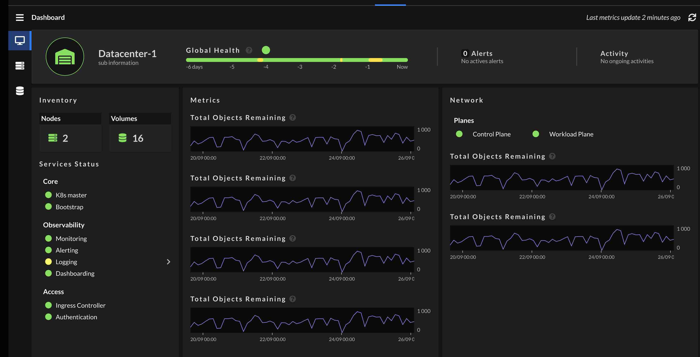
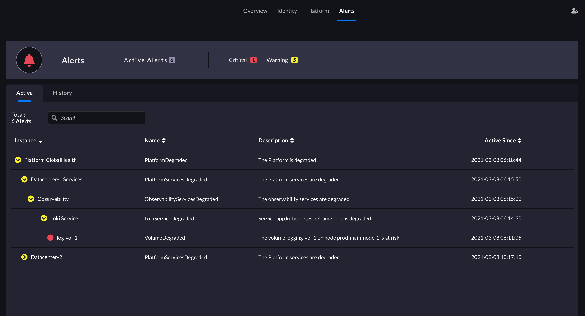

Metalk8s predefined Alert rules and Alert Grouping
==================================================

Context
-------

As part of Metalk8s, we would like to provide the Administrator with built-in
rules expressions that can be used to fire alerts and send notifications when
one of the High Level entities of the system is degraded or impacted by the
degradation of a Low Level component.

As an example, we would like to notify the administrator when the MetalK8s log
service is degraded because of some specific observed symptoms:

* not all log service replicas are scheduled
* one of the persistent volumes claimed by one log service replica is getting
  full.
* Log DB Ingestion rate is near zero

In this specific example, the goal is to invite the administrator to perform
manual tasks to avoid having a Log Service interruption in the near future.

Vocabulary
----------

*Atomic Alert*: An Alert which is based on existing metrics in Prometheus and
which is linked to a specific symptom.

*High Level Alert*: An Alert which is based on other atomic alerts or High
Level alerts.

Requirements
------------

When receiving such High Level alerts, we would like the system to guide the
administrator to find and understand the root cause of the alert as well as
the path to resolve it. Accessing the list of observed low level symptoms will
help the administrator's investigation.

Having the High Level Alerts also helps the administrator to have a
better understanding of what part/layer/component of the System is currently
impacted (without having to build a mental model to guess the impact of any
existing atomic alert in the System)

A bunch of atomic alerts are already deployed but we don’t yet have the
High Level Alerts that we could use to build the above the MetalK8s dashboard.
Being able to define the impact of one atomic alert is a way to build those
High Level Alerts:

It is impossible to modelize all possible causes through this kind of impacting
tree. However, when an alert is received, the system shall suggest other alerts
that may be linked to it, (maybe using matching labels).

Also, when accessing the Node or the Volume page / alert tab, the administrator
should be able to visualise all the fired alerts that are described under Nodes
or Volumes entities.

In the end, the way to visualise the impact of an atomic alert in the alert
page is described with the screenshot below:

The High Level alerts should be easily identifiable in order to filter it out
in the UI views. Indeed, the a first iteration we might want to display the
atomic alerts only until all High Level alerts are implemented and deployed.

Severity Classification
-----------------------

* Critical Alert = Red = Service Offline or At Risk, requires immediate
  intervention
* Warning Alert = Yellow = Service Degraded, requires planned (within 1 week)
  intervention
* No Active Alert = Green = Service Healthy

Notifications are either a mail, slack message or whatever routing supported by
AlertManager or a decorated icon in the UI.

Data Model
----------

We consider that Nodes and Volumes don't impact the Platform directly. As such
they are not belonging to Platform.

`Volumes`_

`Nodes`_

* `System Partitions`_

`Platform`_

* `Platform Services`_

    * `Core`_

    * `Observability`_

    * `Access`_

* `Network`_

Platform
********

.. _PlatformAtRisk:

.. csv-table:: PlatformAtRisk
   :align: left
   :widths: 50,200

   "Severity", "Critical"
   "Summary", "The Platform is at risk"
   "Parent", "*none*"

.. csv-table::
   :header: "Sub Alert", "Severity", "Filter"
   :widths: 200,50,250

   `PlatformServicesAtRisk`_ , Critical

.. _PlatformDegraded:

.. csv-table:: PlatformDegraded
   :align: left
   :widths: 50,200

   "Severity", "Warning"
   "Summary", "The Platform is degraded"
   "Parent", "*none*"

.. csv-table::
   :header: "Sub Alert", "Severity", "Filter"
   :widths: 200,50,250

   `PlatformServicesDegraded`_ , Warning
   `ControlPlaneNetworkDegraded`_, Warning
   `WorkloadPlaneNetworkDegraded`_, Warning

Nodes
*****

.. _NodeAtRisk:

.. csv-table:: NodeAtRisk
   :align: left
   :widths: 50,200

   "Severity", "Critical"
   "Summary", "Node <nodename> is at risk"
   "Parent", "none"

.. csv-table::
   :header: "Sub Alert", "Severity", "Filter"
   :widths: 200,50,250

   KubeletClientCertificateExpiration, Critical
   NodeRAIDDegraded, Critical
   `SystemPartitionAtRisk`_, Critical

.. _NodeDegraded:

.. csv-table:: NodeDegraded
   :align: left
   :widths: 50,200

   "Severity", "Warning"
   "Summary", "Node <nodename> is degraded"
   "Parent", "none"

.. csv-table::
   :header: "Sub Alert", "Severity", "Filter"
   :widths: 200,50,250

   KubeNodeNotReady, Warning
   KubeNodeReadinessFlapping, Warning
   KubeNodeUnreachable, Warning
   KubeletClientCertificateExpiration, Warning
   KubeletClientCertificateRenewalErrors, Warning
   KubeletPlegDurationHigh, Warning
   KubeletPodStartUpLatencyHigh, Warning
   KubeletServerCertificateExpiration, Warning
   KubeletServerCertificateExpiration, Warning
   KubeletServerCertificateRenewalErrors, Warning
   KubeletTooManyPods, Warning
   NodeClockNotSynchronising, Warning
   NodeClockSkewDetected, Warning
   NodeRAIDDiskFailure, Warning
   NodeTextFileCollectorScrapeError, Warning
   `SystemPartitionDegraded`_, Warning

Currently no atomic Alert is defined yet for the following

* System Unit (kubelet, containerd, salt-minion, ntp) would need to enrich
  node exporter
* RAM
* CPU

System Partitions
*****************

.. _SystemPartitionAtRisk:

.. csv-table:: SystemPartitionAtRisk
   :align: left
   :widths: 50,200

   "Severity", "Warning"
   "Summary", "The partition <mountpoint> on node <nodename> is at risk"
   "Parent", "`NodeAtRisk`_"

.. csv-table::
   :header: "Sub Alert", "Severity", "Filter"
   :widths: 200,50,250

   NodeFilesystemAlmostOutOfSpace, Critical,
   NodeFilesystemAlmostOutOfFiles, Critical,
   NodeFilesystemFilesFillingUp, Critical,
   NodeFilesystemSpaceFillingUp, Critical,

.. _SystemPartitionDegraded:

.. csv-table:: SystemPartitionDegraded
   :align: left
   :widths: 50,200

   "Severity", "Warning"
   "Summary", "The partition <mountpoint> on node <nodename> is degraded"
   "Parent", "`NodeDegraded`_"

.. csv-table::
   :header: "Sub Alert", "Severity", "Filter"
   :widths: 200,50,250

   NodeFilesystemAlmostOutOfSpace, Warning,
   NodeFilesystemAlmostOutOfFiles, Warning,
   NodeFilesystemFilesFillingUp, Warning,
   NodeFilesystemSpaceFillingUp, Warning,

Volumes
*******

.. _VolumeAtRisk:

.. csv-table:: VolumeAtRisk
   :align: left
   :widths: 50,200

   "Severity", "Critical"
   "Summary", "The volume <volumename> on node <nodename> is at risk"
   "Parent", "*multiple parents*"

.. csv-table::
   :header: "Sub Alert", "Severity", "Filter"
   :widths: 200,50,250

   KubePersistentVolumeErrors, Warning,
   KubePersistentVolumeFillingUp, Critical,

.. _VolumeDegraded:

.. csv-table:: VolumeDegraded
   :align: left
   :widths: 50,200

   "Severity", "Warning"
   "Summary", "The volume <volumename> on node <nodename> is degraded"
   "Parent", "*multiple parents*"

.. csv-table::
   :header: "Sub Alert", "Severity", "Filter"
   :widths: 200,50,250

   KubePersistentVolumeFillingUp, Warning,

Platform Services
*****************

.. _PlatformServicesAtRisk:

.. csv-table:: PlatformServicesAtRisk
   :align: left
   :widths: 50,200

   "Severity", "Critical"
   "Summary", "The Platform services are at risk"
   "Parent", "`PlatformAtRisk`_"

.. csv-table::
   :header: "Sub Alert", "Severity", "Filter"
   :widths: 200,50,250

   `CoreServicesAtRisk`_, Critical,
   `ObservabilityServicesAtRisk`_, Critical,

.. _PlatformServicesDegraded:

.. csv-table:: PlatformServicesDegraded
   :align: left
   :widths: 50,200

   "Severity", "Warning"
   "Summary", "The Platform services are degraded"
   "Parent", "`PlatformDegraded`_"

.. csv-table::
   :header: "Sub Alert", "Severity", "Filter"
   :widths: 200,50,250

   `CoreServicesDegraded`_, Warning,
   `ObservabilityServicesDegraded`_, Warning,
   `AccessServicesDegraded`_, Warning,

Core
****

.. _CoreServicesAtRisk:

.. csv-table:: CoreServicesAtRisk
   :align: left
   :widths: 50,200

   "Severity", "Critical"
   "Summary", "The Core services are at risk"
   "Parent", "`PlatformServicesAtRisk`_"

.. csv-table::
   :header: "Sub Alert", "Severity", "Filter"
   :widths: 200,50,250

   `K8sMasterServicesAtRisk`_, Critical,

.. _CoreServicesDegraded:

.. csv-table:: CoreServicesDegraded
   :align: left
   :widths: 50,200

   "Severity", "Warning"
   "Summary", "The Core services are degraded"
   "Parent", "`PlatformServicesDegraded`_"

.. csv-table::
   :header: "Sub Alert", "Severity", "Filter"
   :widths: 200,50,250

   `K8sMasterServicesDegraded`_, Critical,
   `BootstrapServicesDegraded`_, Critical,

.. _K8sMasterServicesAtRisk:

.. csv-table:: K8sMasterServicesAtRisk
   :align: left
   :widths: 50,200

   "Severity", "Warning"
   "Summary", "The kubernetes master services are at risk"
   "Parent", "`CoreServicesAtRisk`_"

.. csv-table::
   :header: "Sub Alert", "Severity", "Filter"
   :widths: 200,50,250

   KubeAPIErrorBudgetBurn, Critical,
   etcdHighNumberOfFailedGRPCRequests, Critical,
   etcdGRPCRequestsSlow, Critical,
   etcdHighNumberOfFailedHTTPRequests, Critical,
   etcdInsufficientMembers, Critical,
   etcdMembersDown, Critical,
   etcdNoLeader, Critical,
   KubeStateMetricsListErrors, Critical,
   KubeStateMetricsWatchErrors, Critical,
   KubeAPIDown, Critical,
   KubeClientCertificateExpiration, Critical,
   KubeClientCertificateExpiration, Critical,
   KubeControllerManagerDown, Critical,
   KubeletDown, Critical,
   KubeSchedulerDown, Critical,

.. _K8sMasterServicesDegraded:

.. csv-table:: K8sMasterServicesDegraded
   :align: left
   :widths: 50,200

   "Severity", "Warning"
   "Summary", "The kubernetes master services are degraded"
   "Parent", "`CoreServicesDegraded`_"

.. csv-table::
   :header: "Sub Alert", "Severity", "Filter"
   :widths: 200,50,250

   KubeAPIErrorBudgetBurn, Warning,
   etcdHighNumberOfFailedGRPCRequests, Warning,
   etcdHTTPRequestsSlow, Warning,
   etcdHighCommitDurations, Warning,
   etcdHighFsyncDurations, Warning,
   etcdHighNumberOfFailedHTTPRequests, Warning,
   etcdHighNumberOfFailedProposals, Warning,
   etcdHighNumberOfLeaderChanges, Warning,
   etcdMemberCommunicationSlow, Warning,
   KubeCPUOvercommit, Warning,
   KubeCPUQuotaOvercommit, Warning,
   KubeMemoryOvercommit, Warning,
   KubeMemoryQuotaOvercommit, Warning,
   KubeClientCertificateExpiration, Warning,
   KubeClientErrors, Warning,
   KubeVersionMismatch, Warning,
   KubeDeploymentReplicasMismatch, Warning,kube-system/coredns
   KubeDeploymentReplicasMismatch, Warning,metalk8s-monitoring/prometheus-adapter
   KubeDeploymentReplicasMismatch, Warning,metalk8s-monitoring/prometheus-operator-kube-state-metrics

.. _BootstrapServicesDegraded:

.. csv-table:: BootstrapServicesDegraded
   :align: left
   :widths: 50,200

   "Severity", "Warning"
   "Summary", "The bootstrap services are degraded"
   "Parent", "`CoreServicesDegraded`_"

.. csv-table::
   :header: "Sub Alert", "Severity", "Filter"
   :widths: 200,50,250

   KubePodNotReady, Warning, kube-system/repositories-<bootstrapname>
   KubePodNotReady, Warning, kube-system/salt-master-<bootstrapname>
   KubeDeploymentReplicasMismatch, Warning, kube-system/storage-operator
   KubeDeploymentReplicasMismatch, Warning, metalk8s-ui/metalk8s-ui

.. note::

   The name of the bootstrap node depends on how MetalK8s is deployed. We would
   need to automatically configure this alert during deployment. We may want
   to use more deterministic filter to find out the repository and salt-master
   pods.

Observability
*************

.. _ObservabilityServicesAtRisk:

.. csv-table:: ObservabilityServicesAtRisk
   :align: left
   :widths: 50,200

   "Severity", "Critical"
   "Summary", "The observability services are at risk"
   "Parent", "`PlatformServicesAtRisk`_"

.. csv-table::
   :header: "Sub Alert", "Severity", "Filter"
   :widths: 200,50,250

   `MonitoringServiceAtRisk`_, Critical,
   `AlertingServiceAtRisk`_, Critical,
   `LoggingServiceAtRisk`_, Critical,

.. _ObservabilityServicesDegraded:

.. csv-table:: ObservabilityServicesDegraded
   :align: left
   :widths: 50,200

   "Severity", "Warning"
   "Summary", "The observability services are degraded"
   "Parent", "`PlatformServicesDegraded`_"

.. csv-table::
   :header: "Sub Alert", "Severity", "Filter"
   :widths: 200,50,250

   `MonitoringServiceDegraded`_, Warning,
   `AlertingServiceDegraded`_, Warning,
   `DashboardingServiceDegraded`_, Warning,
   `LoggingServiceDegraded`_, Warning,

.. _MonitoringServiceAtRisk:

.. csv-table:: MonitoringServiceAtRisk
   :align: left
   :widths: 50,200

   "Severity", "Warning"
   "Summary", "The monitoring service is at risk"
   "Parent", `ObservabilityServicesAtRisk`_

.. csv-table::
   :header: "Sub Alert", "Severity", "Filter"
   :widths: 200,50,250

   PrometheusRuleFailures, Critical,
   PrometheusRemoteWriteBehind, Critical,
   PrometheusRemoteStorageFailures, Critical,
   PrometheusErrorSendingAlertsToAnyAlertmanager, Critical,
   PrometheusBadConfig, Critical,

.. _MonitoringServiceDegraded:

.. csv-table:: MonitoringServiceDegraded
   :align: left
   :widths: 50,200

   "Severity", "Warning"
   "Summary", "The monitoring service is degraded"
   "Parent", `ObservabilityServicesDegraded`_

.. csv-table::
   :header: "Sub Alert", "Severity", "Filter"
   :widths: 200,50,250

   `VolumeDegraded`_ , Warning, app.kubernetes.io/name=prometheus-operator-prometheus
   `VolumeAtRisk`_, Critical,app.kubernetes.io/name=prometheus-operator-prometheus
   TargetDown, Warning, To be defined
   PrometheusTargetLimitHit, Warning,
   PrometheusTSDBReloadsFailing, Warning,
   PrometheusTSDBCompactionsFailing, Warning,
   PrometheusRemoteWriteDesiredShards, Warning,
   PrometheusOutOfOrderTimestamps, Warning,
   PrometheusNotificationQueueRunningFull, Warning,
   PrometheusNotIngestingSamples, Warning,
   PrometheusNotConnectedToAlertmanagers, Warning,
   PrometheusMissingRuleEvaluations, Warning,
   PrometheusErrorSendingAlertsToSomeAlertmanagers, Warning,
   PrometheusDuplicateTimestamps, Warning,
   PrometheusOperatorWatchErrors, Warning,
   PrometheusOperatorSyncFailed, Warning,
   PrometheusOperatorRejectedResources, Warning,
   PrometheusOperatorReconcileErrors, Warning,
   PrometheusOperatorNotReady, Warning,
   PrometheusOperatorNodeLookupErrors, Warning,
   PrometheusOperatorListErrors, Warning,
   KubeStatefulSetReplicasMismatch, Warning, metalk8s-monitoring/prometheus-prometheus-operator-prometheus
   KubeDeploymentReplicasMismatch, Warning, metalk8s-monitoring/prometheus-operator-operator
   KubeDaemonSetNotScheduled, Warning, metalk8s-monitoring/prometheus-operator-prometheus-node-exporter

.. _LoggingServiceAtRisk:

.. csv-table:: LoggingServiceAtRisk
   :align: left
   :widths: 50,200

   "Severity", "Critcal"
   "Summary", "The logging service is at risk"
   "Parent", `ObservabilityServicesAtRisk`_

.. csv-table::
   :header: "Sub Alert", "Severity", "Filter"
   :widths: 200,50,250

   AlertmanagerConfigInconsistent, Critical,
   AlertmanagerMembersInconsistent , Critical,
   AlertmanagerFailedReload, Critical,

.. _LoggingServiceDegraded:

.. csv-table:: LoggingServiceDegraded
   :align: left
   :widths: 50,200

   "Severity", "Warning"
   "Summary", "The logging service is degraded"
   "Parent", `ObservabilityServicesDegraded`_

.. csv-table::
   :header: "Sub Alert", "Severity", "Filter"
   :widths: 200,50,250

   `VolumeDegraded`_, Warning, app.kubernetes.io/name=loki
   `VolumeAtRisk`_, Critical, app.kubernetes.io/name=loki
   TargetDown, Warning, To be defined
   KubeStatefulSetReplicasMismatch , Warning, metalk8s-logging/loki
   KubeDaemonSetNotScheduled, Warning,metalk8s-logging/fluentbit

.. _AlertingServiceAtRisk:

.. csv-table:: AlertingServiceAtRisk
   :align: left
   :widths: 50,200

   "Severity", "Critcal"
   "Summary", "The alerting service is at risk"
   "Parent", `ObservabilityServicesAtRisk`_

.. csv-table::
   :header: "Sub Alert", "Severity", "Filter"
   :widths: 200,50,250

   AlertmanagerConfigInconsistent, Critical,
   AlertmanagerMembersInconsistent , Critical,
   AlertmanagerFailedReload, Critical,

.. _AlertingServiceDegraded:

.. csv-table:: AlertingServiceDegraded
   :align: left
   :widths: 50,200

   "Severity", "Warning"
   "Summary", "The alerting service is degraded"
   "Parent", `ObservabilityServicesDegraded`_

.. csv-table::
   :header: "Sub Alert", "Severity", "Filter"
   :widths: 200,50,250

   `VolumeDegraded`_, Warning,app.kubernetes.io/name=prometheus-operator-alertmanager
   `VolumeAtRisk`_, Critical, app.kubernetes.io/name=prometheus-operator-alertmanager
   TargetDown, Warning, To be defined
   KubeStatefulSetReplicasMismatch , Warning, metalk8s-monitoring/alertmanager-prometheus-operator-alertmanager
   AlertmanagerFailedReload, Warning,

.. _DashboardingServiceDegraded:

.. csv-table:: DashboardingServiceDegraded
   :align: left
   :widths: 50,200

   "Severity", "Warning"
   "Summary", "The dashboarding service is degraded"
   "Parent", `ObservabilityServicesDegraded`_

.. csv-table::
   :header: "Sub Alert", "Severity", "Filter"
   :align: left
   :widths: 200,50,250

   "KubeStatefulSetReplicasMismatch", "Warning", "metalk8s-monitoring/prometheus-operator-grafana"
   "TargetDown", "Warning", "To be defined"

Network
*******

.. _ControlPlaneNetworkDegraded:

.. csv-table:: ControlPlaneNetworkDegraded
   :align: left
   :widths: 50,200

   "Severity", "Warning"
   "Summary", "The Control Plane Network is degraded"
   "Parent", `PlatformDegraded`_

.. csv-table::
   :header: "Sub Alert", "Severity", "Filter"
   :align: left
   :widths: 200,50,250

   "NodeNetworkReceiveErrs", "Warning", "Need to filter on the proper cp interface"
   "NodeHighNumberConntrackEntriesUsed", "Warning", "Need to filter on the proper cp interface"
   "NodeNetworkTransmitErrs", "Warning", "Need to filter on the proper cp interface"
   "NodeNetworkInterfaceFlapping", "Warning", "Need to filter on the proper cp interface"

.. _WorkloadPlaneNetworkDegraded:

.. csv-table:: WorkloadPlaneNetworkDegraded
   :align: left
   :widths: 50,200

   "Severity", "Warning"
   "Summary", "The Workload Plane Network is degraded"
   "Parent", `PlatformDegraded`_

.. csv-table::
   :header: "Sub Alert", "Severity", "Filter"
   :align: left
   :widths: 200,50,250

   "NodeNetworkReceiveErrs", "Warning", "Need to filter on the proper wp interface"
   "NodeHighNumberConntrackEntriesUsed", "Warning", "Need to filter on the proper wp interface"
   "NodeNetworkTransmitErrs", "Warning", "Need to filter on the proper wp interface"
   "NodeNetworkInterfaceFlapping", "Warning", "Need to filter on the proper wp interface"

.. note::

   The name of the interface used by Workload Plane and/or Control Plane is
   not known in advance. As such, we should find a way to automatically
   configure the Network alerts based on Network configuration.

.. note::

   Currently we don't have any alerts for the Virtual Plane which is provided
   by kube-proxy, calico-kube-controllers, calico-node. It is not even part of
   the MetalK8s Dashboard page. We may want to introduce it.

Access
******

.. _AccessServicesDegraded:

.. csv-table:: AccessServicesDegraded
   :align: left
   :widths: 50,200

   "Severity", "Warning"
   "Summary", "The Access services are degraded"
   "Parent", `PlatformServicesDegraded`_

.. csv-table::
   :header: "Sub Alert", "Severity", "Filter"
   :align: left
   :widths: 200,50,250

   "`IngressControllerDegraded`_", "Warning",
   "`AuthenticationDegraded`_", "Warning",

.. _IngressControllerDegraded:

.. csv-table:: IngressControllerDegraded
   :align: left
   :widths: 50,200

   "Severity", "Warning"
   "Summary", "The Ingress Controllers for CP and WP are degraded"
   "Parent", `AccessServicesDegraded`_

.. csv-table::
   :header: "Sub Alert", "Severity", "Filter"
   :align: left
   :widths: 200,50,250

   "KubeDeploymentReplicasMismatch", "Warning", "metalk8s-ingress/ingress-nginx-defaultbackend"
   "KubeDaemonSetNotScheduled", "Warning", "metalk8s-system/ingress-nginx-controller"
   "KubeDaemonSetNotScheduled", "Warning", "metalk8s-system/ingress-nginx-control-plane-controller"

.. _AuthenticationDegraded:

.. csv-table:: AuthenticationDegraded
   :align: left
   :widths: 50,200

   "Severity", "Warning"
   "Summary", "The Authentication service for K8S API is degraded"
   "Parent", `AccessServicesDegraded`_

.. csv-table::
   :header: "Sub Alert", "Severity", "Filter"
   :align: left
   :widths: 200,50,250

   "KubeDeploymentReplicasMismatch", "Warning", "metalk8s-auth/dex"
