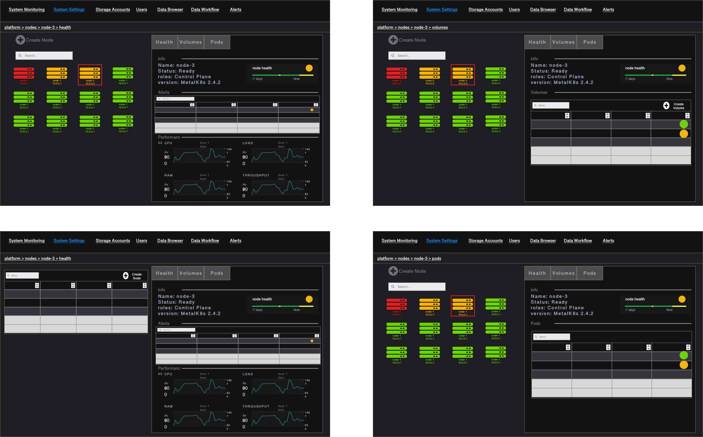
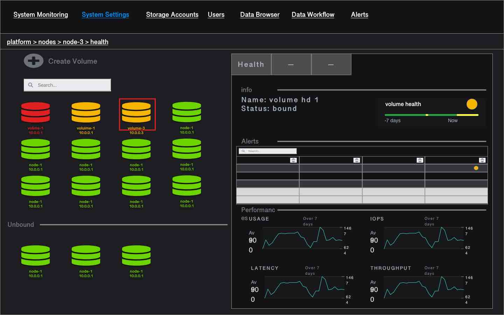

MetalK8s UI adaptation
======================

MetalK8s UI needs adaptation, so that it fits with shell & microfrontends
architecture. In the long term, MetalK8s UI always runs with a Shell Nav bar.
MetalK8s also provides a secondary lateral Nav bar.

The MetalK8s secondary lateral Nav bar should contains entries that are
specific to MetalK8s micro application. Features like login/logout, switching
from dark to light mode or switching language are to be exposed in the Shell
Nav bar.

The MetalK8s UI exposes MetalK8s operations to users having Platform
Administrator role. It also provides High Level Monitoring and Alerting views
in order for the Platform Administrator to understand the health and the
performances of the platform.

The platform entities to operate and monitor are:

- the Hardware entities (servers, disks, raids, interfaces or Network)
- the OS and k8s system services (kubelet and conatinerd)
- the Kubernetes services (etcd, apiserver, scheduler)
- the Kubernetes entities (Nodes, Volumes)
- the specific MetalK8s services (Monitoring, Alerting, Logging,
  Authentication, Ingress)

MetalK8s Operations
-------------------

- Cluster administration (upgrade, downgrade, backup, restore)
- Cluster nodes provisioning (adding/removing nodes, configuring nodes)
- Volume provisioning (adding/removing Volumes, configuring volumes)
- Solution lifecycle (adding/deleting envs, activate/adding solutions)
- MetalK8s services administration (configuring alerts, scaling service)
- roles and security policies management

Some of the operations are not exposed through API and thus cannot be exposed
in the UI. The operations that are accessible in the UI are served through
either K8S or Salt APIs. Not all operations are critical to have in the UI.

Some operations, such as cluster expansion or volume addition can be time
consuming. MetalK8s UI should provide some indication of the progress and ETA.
It should also provide easy way to debug and investigate when things go wrong.
Thus logs associated to an expansion or volume provisioning should be easily
accessible from MetalK8s UI.

Last but not least, all important operations performed on the platform (such as
adding/removing a node, upgrading the cluster, ...) should be logged.
Browsing the history of those operations should be accessible from MetalK8s UI.

MetalK8s Monitoring
-------------------

*Health*

The Health of the system as well as the health of any specific entity of the
system, is determined by the existence of an active alert, with a specific
severity on it. It is probably needed to filter out some alerts that must not
be taken in account to determine the health of any system entity.

The Global health of the platform is either a magic combination of some
important entity alerts, either a specific Scality alert delivered with
MetalK8s.

*Performance*

Some perf kpis & charts are available for each entity or group of entities. The
aim of those charts is not to replace the Grafana dashboards but to give some
high level and synthetic views, focused on what's matter the most for the
MetalK8s Platform administrator.

MetalK8s Pages
--------------

**Overview / Landing Page**

As a Platform Administrator, I Want to visualize the key components and
services of the platform, In order to understand how the platform works.

As a Platform Administrator, I Want to identify real time and past failures,
In order to act on it and fix the it.

As a Platform Administrator, I Want to visualize high level performances of the
key HW components, In order to understand real time and past load as well as
forecast the load.

When landing on the MetalK8s microapp, an overview of the health and
performances of the cluster is displayed. The page is focusing on one single
cluster i.e. one single site.

The page is divided in 3 sections:

- global health: the history of alerts and the current health of the system. If
  the health of the system is degraded, when the Platform Administrator click
  on it, he is redirected to the alert page which is automatically filtered on
  the active alerts.
- health of each platform entities: nodes, volumes, k8s master services,
  monitoring services, logging service, ingress services and auth service. if
  one entity is not healthy, we can click on it and access the list of active
  alerts associated with this entity, in the entity page.
- performances: several charts are displayed to show aggregated load,
  aggregated CPU usage, aggregated RAM usage, aggregated IOPS usage and
  aggregated throughput for both CP and WP networks. Ideally, Top 10 slowest
  disks are also displayed.

  .. image:: img/overview.jpg

**Nodes Page**

As a Platform Administrator, I Want to have a list of the nodes making the
cluster as well as detailed information about each node, including node health,
in order to identify nodes at risk.

The Nodes Page provides a list of all MetalK8s cluster nodes. For each node,
one can see its status and health (most severe active alert), MetalK8s version
and roles. It is also from where the Platform Administrator can expand the
cluster (i.e. add a node) or access to advanced details about this node.

The list of MetalK8s cluster nodes can be displayed as a table in a first
iteration but ideally, they are displayed as cards and the nodes having issues
are displayed first. In both cases, a search field is available in order to
filter the list of nodes we see in the table or as cards.

When the Platform Administrator click on a node, detailed information of this
node is displayed in the right zone of the page (could be bottom zone). That
way, the Platform Administrator can focus on one specific node while keeping
the table or the cards as a way to navigate to another node.

**Node Panel**

When clicking on one node in the nodes page, it is possible to access various
information about the node through specific tabs.

High level Node information contains its name, its ip, its role, its status.
Those High level information are always visible, whatever tab is active.

- health
- volumes
- pods

The health is the tab displayed at first when accessing the node.

*health*

The list of active and past alerts as well as Key performance indicators over
the last 7 days help the Platform Administrator to understand the behaviour of
this specific node.
Alert table: Name, instance, Severity, Message, Active Since
KPIs charts: CPU, Load, Memory, IOPS, WP and CP IO bandwidth. The list of KPI
may be different for K8s master nodes and K8s worker nodes.

*volumes*

A table with the list of Volumes created on this node. For each volume, status,
health, bounded / available, type and size is available. When clicking on one
Volume, it is possible to access various information about this specific
Volume in the Volume page.

*pods*

A table with the list of pods scheduled on this node. For each pod, status,
health, age, namespace are displayed.

.. note:: The Node Panel is also where the node creation form would be
          displayed when the platform administrator clicks on Add Node.

**Volumes Page**

The Volumes page contains a table with all provisioned Volumes into the system.
This view enables to quickly identify the Volumes that are not yet bound to any
pod or workload (those Volumes should appear within a dedicated section if they
are displayed as cards). It also gives an overview of all created Volumes and
their health and status. From the Volumes page it is possible to create a new
Volume.

Volumes Table Columns:

- Name
- Node
- Storage class
- Bound: no or pod name if bound
- Status: Available of Failed (if Volume provisioning failed)
- Health: based on active alert existence
- Size (or storage capacity)
- Usage (%utilization) with some gauge bar renderer
- Creation time
- Action (delete/edit) with some icon renderer

Ideally we also want to have avg latency so that we can easily sort Volumes by
latency in order to quickly identify slowest disks. If it is too much
information to put in the table, we can have another table with only
Name, Node, Health and latency information at the bottom of the main volumes
table.

.. note:: One of the duty of the Platform Administrator is also to have a view
          of the available disks or devices out of which we could create
          Volumes / PVs. The Platform Administrator will want to know what are
          the available devices and if they are healthy. Also when a disk is
          not healthy, the Platform Administrator will want this disk to be
          easily identified in the data center (i.e. blinking the disk)

**Volume Panel**

When clicking on one volume in the volumes page, it is possible to access
various information about the volume through specific tabs:

- All table infos
- Labels
- Type (block device or loop device)
- Pod name (if the volume is bound)

High level Volume information contains its name, the node it belongs to, its
status, the pod it is bound to.
Those High level information are always visible, whatever tab is active.

- health

*health*

The list of active and past alerts as well as Key performance indicators over
the last 7 days help the Platform Administrator to understand the behaviour of
this specific node.
Alert table: Name, instance, Severity, Message, Active Since
KPIs charts: Usage (used, total, available), IOPS, IO Latency and IO bandwidth.

.. note:: The Volume Panel is also where the volume creation form would be
          displayed when the platform administrator clicks on Add Volume.

**Cards vs Table for Nodes ad Volumes**

Cards offer a more sexy way of presenting instances. We can even layout or
group cards according to some business logic criteria. However we can't display
lot of information or sort the cards. The table is may be less fancy, however
it helps the user to visualize lot of information at the same time, it usually
embeds out of the box sorting, filtering and top 10 capabilities. Also each
cell can be rendered using fancy components (an not only text).

**MetalK8s services**

As a reminder, the list of MetalK8s services are the following:

- k8s master
- bootstrap (OCI registry & salt)
- monitoring
- logging
- ingress
- auth

As a Platform Administrator, I want to make sure all MetalK8s services are
running properly, in order to make sure Solution instances can run properly and
other admin users can perform their tasks.

As a Platform Administrator I want to understand on which nodes, each service
sub components are scheduled and what are the Volumes involved if any, In order
to know HW entities that may have an impact on it.

As an example, monitoring service is made of Prometheus to store all statistics
as well as Alert Manager to manage the alerts.

As a Platform Administrator I want to know if there are some actives alerts on
a service and I want to visualize the history of alerts In order to act on it
to fix the issue.

As a Platform Administrator I want to to know how a service is behaving in
terms of performances (CPU, Load, Memory, IO), In order to anticipate potential
failure events.

As a Platform Administrator, I want to scale up/down one service, In order to
better handle the load.

The Platform Administrator may also need dedicated pages in order to configure
the various services (mainly thinking about alerting, auth and ingress)

**Environment & solution Page**

As a Platform administrator I want to create an MK8s  environment (production /
Staging / Test...) in order to install the Scality data and storage management
solutions

As a Storage administrator I want to add and manage solution lifecycle within
an environment in order to upgrade/downgrade the Scality data and storage
management solutions components.

In the long term, those functionalities may need to be exposed outside of
metalK8s, especially if we need to deploy environment and solutions across
multiple cluster or sites.

**System Settings Page**

No detailed functionalities for now. This could be from where the Platform
Administrator would trigger platform upgrade, downgrade, restore or backup.

**Alerts Page**

From this page the Platform Administrator can visualize all past and current
alerts belonging to any entity of the platform. When clicking on one specific
alert, the user is redirected the specific entity / health page on which the
alert was fired.

**Overall Navigation**

.. image:: img/navdeck.jpg
