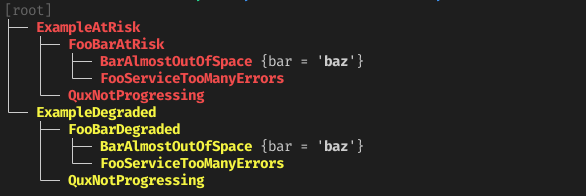

Usage
=====

Make sure you have :doc:`installed the library <./install>` and its
dependencies already (enable the ``cli`` extra).

Create a simple Python module called ``example.py``, and paste the following
contents (or download it :download:`from here <examples/example.py>`):

.. literalinclude:: examples/example.py
   :language: python

Read through the comments for an explanation of the basic features of this
library.

Now, simply run the following to display the tree of alerts you just defined:

.. code:: console

   $ python -m example show

This will print out to the console:

You can also generate a *PrometheusRule* manifest using:

.. code:: console

   $ python -m example gen-rule \
       --name example.rules --namespace example \
       --out example_rule.yaml

The generated manifest should look like
:download:`this one <examples/example_rule.yaml>`. Note that only
``DerivedAlert`` instances are part of this manifest (exiting alerts should not
need any additional rules, and are only referred to in the derived ``expr``).

Use the ``--help`` option to print a help message and discover more
functionalities provided by these commands.

Going Further
-------------

To see a more advanced example, have a look at the MetalK8s alert tree defined
under ``tools/lib-alert-tree/metalk8s``. An easy access is provided through
a ``tox`` environment:

.. code:: console

   $ tox -e alert-tree -- show
