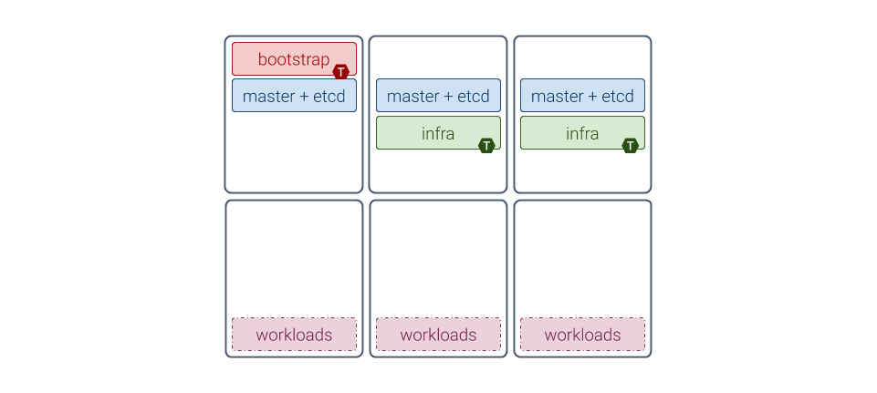
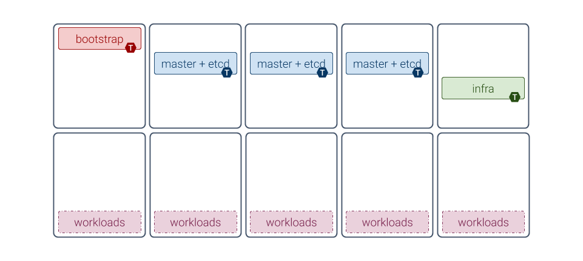
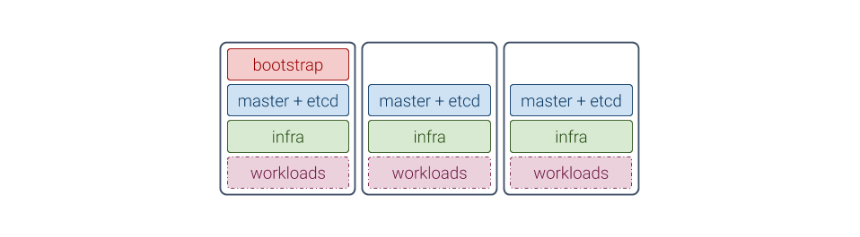

Introduction
============

Foreword
^^^^^^^^
MetalK8s is a Kubernetes_ distribution with a number of add-ons selected for
on-premises deployments, including pre-configured monitoring and alerting,
self-healing system configuration, and more.

Installing a MetalK8s cluster can be broken down into the following steps:

#. :doc:`Setup <./setup>` of the environment
#. :doc:`Deployment <./bootstrap>` of the :term:`Bootstrap node`, the first
   machine in the cluster
#. :doc:`Expansion <./expansion>` of the cluster, orchestrated from the
   Bootstrap node
#. :doc:`Post installation <./post-install>` configuration steps and sanity
   checks

.. warning::

   MetalK8s is not designed to handle world-distributed multi-site
   architectures. Instead, it provides a highly resilient cluster at the
   datacenter scale. To manage multiple sites, look into application-level
   solutions or alternatives from such the communities as `the Multicluster SIG
   <https://github.com/kubernetes/community/tree/master/sig-multicluster>`_).

.. _Kubernetes: https://kubernetes.io/

.. _installation-intro-architecture:

Choosing a Deployment Architecture
^^^^^^^^^^^^^^^^^^^^^^^^^^^^^^^^^^

Before starting the installation, you must choose an architecture.

Standard Architecture
"""""""""""""""""""""

The recommended architecture when installing a small MetalK8s cluster emphasizes
ease of installation, while providing high stability for scheduled
workloads. This architecture includes:

- One machine running Bootstrap and control plane services
- Two other machines running control plane and infra services
- Three more machines for workload applications

Machines dedicated to the control plane do not require many resources (see
:ref:`the sizing notes below<installation-intro-sizing>`), and can safely run as
virtual machines. Running workloads on dedicated machines makes them simpler to
size, as MetalK8s impact will be negligible.

.. note:: "Machines" may indicate bare-metal servers or VMs interchangeably.

Extended Architecture
"""""""""""""""""""""

This example architecture focuses on reliability rather than compactness,
offering the finest control over the entire platform:

- One machine dedicated to running Bootstrap services (see
  :ref:`the Bootstrap role<node-role-bootstrap>` definition below)
- Three extra machines (or five if installing a really large cluster,
  e.g. > 100 nodes) for running the Kubernetes_ control plane (with
  :ref:`core K8s services<node-role-master>` and the backing
  :ref:`etcd DB<node-role-etcd>`)
- One or more machines dedicated to running infra services (see
  :ref:`the infra role<node-role-infra>`)
- Any number of machines dedicated to running applications, the number and
  :ref:`sizing<installation-intro-sizing>` depending on the application (for
  instance, Zenko_ recommends three or more machines)

.. _Zenko: https://zenko.io/

.. _installation-intro-compact-arch:

Compact Architectures
"""""""""""""""""""""

Although its design is not focused on having the smallest compute and memory
footprints, MetalK8s can provide a fully functional single-node "cluster". The
bootstrap node can be configured to also allow running applications next to all
other required services (see :ref:`the section about taints<node-taints>`
below).

Because a single-node cluster has no resilience to machine or site failure, a
three-machine cluster is the most compact recommended production
architecture. This architecture includes:

- Two machines running control plane services alongside infra and workload
  applications
- One machine running bootstrap services and all other services

.. note::

   Sizing for such compact clusters must account for the expected load. The
   exact impact of colocating an application with MetalK8s services must be
   evaluated by that application's provider.

Variations
""""""""""

You can customize your architecture using combinations of
:ref:`roles<node-roles>` and :ref:`taints<node-taints>`, described below, to
adapt to the available infrastructure.

Generally, it is easier to monitor and operate well-isolated groups of machines
in the cluster, where hardware issues only impact one group of services.

You can also evolve an architecture after initial deployment, if the underlying
infrastructure also evolves (new machines can be added through the
:doc:`expansion<./expansion>` mechanism, roles can be added or removed, etc.).

Concepts
^^^^^^^^

Although familiarity with
`Kubernetes concepts <https://kubernetes.io/docs/concepts/>`_
is recommended, the necessary concepts to grasp before installing a MetalK8s
cluster are presented here.

Nodes
"""""

:term:`Nodes <Node>` are Kubernetes worker machines that allow running
containers and can be managed by the cluster (see :ref:`control plane
services<control_and_workload>`, next section).

.. _control_and_workload:

Control and Workload Planes
"""""""""""""""""""""""""""

The distinction between the control and workload planes is central to MetalK8s,
and often referred to in other Kubernetes concepts.

The **control plane** is the set of machines (called "nodes") and
the services running there that make up the essential Kubernetes functionality
for running containerized applications, managing declarative objects, and
providing authentication/authorization to end users as well as services. The
main components of a Kubernetes control plane are:

- :term:`API Server`
- :term:`Scheduler`
- :term:`Controller Manager`

The **workload plane** is the set of nodes in which applications
are deployed via Kubernetes objects, managed by services in the
control plane.

.. note::

   Nodes may belong to both planes, so that one can run applications
   alongside the control plane services.

Control plane nodes often are responsible for providing storage for
API Server, by running :term:`etcd`. This responsibility may be
offloaded to other nodes from the workload plane (without the etcd taint).

.. _node-roles:

Node Roles
""""""""""

A node's responsibilities are determined using roles. Roles are stored in
:term:`Node manifests <Node manifest>` using labels of the form
``node-role.kubernetes.io/<role-name>: ''``.

MetalK8s uses five different roles, which may be combined freely:

.. _node-role-master:

``node-role.kubernetes.io/master``
  The master role marks a control plane member. :ref:`Control plane
  services<control_and_workload>` can only be scheduled on master nodes.

.. _node-role-etcd:

``node-role.kubernetes.io/etcd``
  The etcd role marks a node running etcd for API Server storage.

.. _node-role-infra:

``node-role.kubernetes.io/infra``
  The infra role is specific to MetalK8s. It marks nodes where non-critical
  cluster services (monitoring stack, UIs, etc.) are running.

.. _node-role-bootstrap:

``node-role.kubernetes.io/bootstrap``
  This marks the Bootstrap node. This node is unique in the cluster, and is
  solely responsible for the following services:

  - An RPM package repository used by cluster members
  - An OCI registry for :term:`Pod <Pod>` images
  - A :term:`Salt Master` and its associated :term:`SaltAPI`

  In practice, this role is used in conjunction with the master and etcd
  roles for bootstrapping the control plane.

In the :ref:`architecture diagrams <installation-intro-architecture>` presented
above, each box represents a role (with the ``node-role.kubernetes.io/`` prefix
omitted).

.. _node-taints:

Node Taints
"""""""""""
:term:`Taints <Taint>` are complementary to roles. When a taint or a set of
taints is applied to a Node, only Pods with the
corresponding :term:`tolerations <Toleration>` can be scheduled on that Node.

Taints allow dedicating Nodes to specific use cases, such as running control
plane services.

Refer to the :ref:`architecture diagrams<installation-intro-architecture>`
above for examples: each **T** marker on a role means the taint corresponding
to this role has been applied on the Node.

Note that Pods from the control plane services (corresponding to master and
etcd roles) have tolerations for the bootstrap and infra taints.
This is because after :doc:`bootstrapping the first Node<./bootstrap>`, it
will be configured as follows:

The taints applied are only tolerated by services deployed by MetalK8s. If the
selected architecture requires workloads to run on the Bootstrap node, these
taints must be removed.

To do this, use the following commands after deployment:

.. code-block:: shell

   root@bootstrap $ kubectl taint nodes <bootstrap-node-name> \
                      node-role.kubernetes.io/bootstrap:NoSchedule-
   root@bootstrap $ kubectl taint nodes <bootstrap-node-name> \
                      node-role.kubernetes.io/infra:NoSchedule-

.. note::

   To get more in-depth information about taints and tolerations, see
   `the official Kubernetes documentation
   <https://kubernetes.io/docs/concepts/configuration/taint-and-toleration/>`_.

.. _installation-intro-networks:

Networks
""""""""

A MetalK8s cluster requires a physical network for both the control plane and
the workload plane Nodes. Although these may be the same network, the
distinction will still be made in further references to these networks, and
when referring to a Node IP address. Each Node in the cluster *must* belong
to these two networks.

The control plane network enables cluster services to communicate with each
other. The workload plane network exposes applications, including those in
infra Nodes, to the outside world.

.. todo:: Reference Ingress

MetalK8s also enables configuring virtual networks for internal communication:

- A network for Pods, defaulting to ``10.233.0.0/16``
- A network for :term:`Services <Service>`, defaulting to ``10.96.0.0/12``

In case of conflicts with existing infrastructure, choose other ranges during
:ref:`Bootstrap configuration <Bootstrap Configuration>`.

Additional Notes
^^^^^^^^^^^^^^^^

.. _installation-intro-sizing:

Sizing
""""""

Sizing the machines in a MetalK8s cluster depends on the selected architecture
and anticipated changes. Refer to the documentation of the applications planned
to run in the deployed cluster before completing the sizing, as their needs will
compete with the cluster's.

Each :ref:`role<node-roles>`, describing a group of services, requires a
certain amount of resources to run properly. If multiple roles are used
on a single Node, these requirements add up.

+----------------+-----------------------+----------+--------+---------------------------------+-----------------------------+
|      Role      |       Services        |   CPU    |  RAM   |        Required Storage         |     Recommended Storage     |
+================+=======================+==========+========+=================================+=============================+
| bootstrap      | Package repositories, | 1 core   | 2 GB   | Sufficient space for the        |                             |
|                | container registries, |          |        | product ISO archives            |                             |
|                | Salt master           |          |        |                                 |                             |
+----------------+-----------------------+----------+--------+---------------------------------+-----------------------------+
| etcd           | etcd database for the | 0.5 core | 1 GB   | 1 GB for                        |                             |
|                | K8s API               |          |        | /var/lib/etcd                   |                             |
+----------------+-----------------------+----------+--------+---------------------------------+-----------------------------+
| master         | K8s API,              | 0.5 core | 1 GB   |                                 |                             |
|                | scheduler, and        |          |        |                                 |                             |
|                | controllers           |          |        |                                 |                             |
+----------------+-----------------------+----------+--------+---------------------------------+-----------------------------+
| infra          | Monitoring services,  | 0.5 core | 2 GB   | 10 GB partition for Prometheus  |                             |
|                | Ingress controllers   |          |        | 1 GB partition for Alertmanager |                             |
+----------------+-----------------------+----------+--------+---------------------------------+-----------------------------+
| *requirements\ | Salt minion,          | 0.2 core | 0.5 GB | **40 GB root partition**        | 100 GB or more for /var     |
| common to\     | Kubelet               |          |        |                                 |                             |
| any Node*      |                       |          |        |                                 |                             |
+----------------+-----------------------+----------+--------+---------------------------------+-----------------------------+

These numbers do not account for highly unstable workloads or other sources of
unpredictable load on the cluster services. Providing a safety margin of an
additional 50% of resources is recommended.

Consider the `official recommendations for etcd sizing
<https://github.com/etcd-io/etcd/blob/master/Documentation/op-guide/hardware.md>`_,
as the stability of a MetalK8s installation depends on the stability of the
backing etcd (see the :ref:`etcd<Setup etcd partition>` section for more
details). Prometheus and Alertmanager also require storage, as explained in
:ref:`Provision Prometheus Storage`.

.. _installation-intro-cloud:

Deploying with Cloud Providers
""""""""""""""""""""""""""""""

When installing in a virtual environment, such as `AWS EC2`_ or `OpenStack`_,
adjust network configurations carefully: virtual environments often add a layer
of security at the port level, which must be disabled or circumvented with
:ref:`IP-in-IP encapsulation<enable IP-in-IP>`.

Also note that Kubernetes has numerous integrations with existing cloud
providers to provide easier access to proprietary features, such as load
balancers. For more information, review `this topic
<https://kubernetes.io/docs/concepts/cluster-administration/cloud-providers/>`_.

.. _AWS EC2: https://aws.amazon.com/ec2/
.. _OpenStack: https://www.openstack.org/
