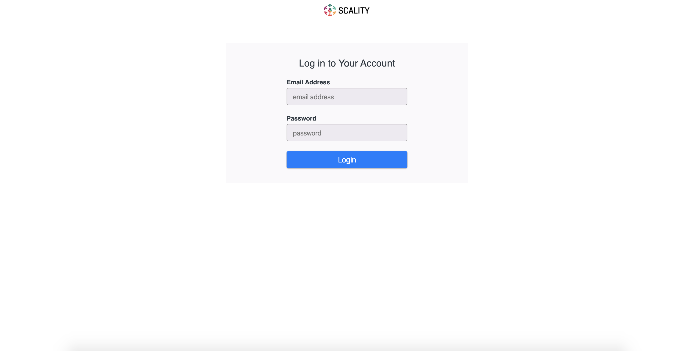

After Installation
==================

After bootstrapping the cluster, the Prometheus and AlertManager services used
to monitor the system will not run (their respective :term:`Pods <Pod>` remain
in the "Pending" state) until persistent storage is available.

.. _Provision Prometheus Storage:

Provision Storage for Prometheus Services
^^^^^^^^^^^^^^^^^^^^^^^^^^^^^^^^^^^^^^^^^

You can either provision storage volumes on the :term:`Bootstrap node`, or
later on other nodes joining the cluster. Separating :ref:`Bootstrap services
<node-role-bootstrap>` from :ref:`Infra services <node-role-infra>` is
recommended.

To create the required "Volume" objects, copy the following code to a YAML
file, replacing ``<node_name>`` with the name of the :term:`Node` on which to
run Prometheus and AlertManager, and ``<device_path[2]>`` with the ``/dev``
path for the partitions to use:

.. code-block:: yaml

   ---
   apiVersion: storage.metalk8s.scality.com/v1alpha1
   kind: Volume
   metadata:
     name: bootstrap-prometheus
   spec:
     nodeName: <node_name>
     storageClassName: metalk8s-prometheus
     sparseLoopDevice:
       size: 10Gi
     template:
       metadata:
         labels:
           app.kubernetes.io/name: 'prometheus-operator-prometheus'
   ---
   apiVersion: storage.metalk8s.scality.com/v1alpha1
   kind: Volume
   metadata:
     name: bootstrap-alertmanager
   spec:
     nodeName: <node_name>
     storageClassName: metalk8s-prometheus
     sparseLoopDevice:
       size: 1Gi
     template:
       metadata:
         labels:
           app.kubernetes.io/name: 'prometheus-operator-alertmanager'
   ---

Once you have created this file with correct values entered, run the following
command to create the volume objects (replacing ``<file_path>`` with the path
of the aforementioned YAML file):

.. code-block:: shell

   root@bootstrap # kubectl --kubeconfig /etc/kubernetes/admin.conf apply -f <file_path>

For more details on the available options for storage management, see
:doc:`Volume Management <../operation/volume_management/index>` in
:ref:`MetalK8s Operation <../operation/index>`.

.. todo::

   - Sanity check
   - Troubleshooting if needed

GUI Validation
^^^^^^^^^^^^^^

If things are installed correctly, you can open and log in to the new bootstrap
server.

Open your browser and access the bootstrap server. Enter the bootstrap server's
IP address or hostname into the browser, specifying port 8443::

  https://<address>:8443

On success, you will see the MetalK8s platform login screen:

The default credentials are:

* Username: **admin**
* Password: **admin**

Changing Credentials
^^^^^^^^^^^^^^^^^^^^

After a fresh installation, an administrator account is created. For production
deployments, change these credentials and use safer values.

To change user credentials and groups for the :term:`K8s API <API Server>` (and
thus for :ref:`MetalK8s GUI <installation-services-admin-ui>` and
:term:`SaltAPI`), see :ref:`ops-k8s-admin`.

To change Grafana user credentials, see :ref:`ops-grafana-admin`.

Validating the Deployment
^^^^^^^^^^^^^^^^^^^^^^^^^

To ensure the Kubernetes cluster is properly running before scheduling
applications, perform the following sanity checks:

#. Check that all desired Nodes are in a ``Ready`` state and show the expected
   :ref:`roles <node-roles>`:

   .. code-block:: shell

      root@bootstrap # kubectl --kubeconfig /etc/kubernetes/admin.conf get nodes

      NAME         STATUS   ROLES                         AGE   VERSION
      bootstrap    Ready    bootstrap,etcd,infra,master   42m   v1.15.5
      node-1       Ready    etcd,infra,master             26m   v1.15.5
      node-2       Ready    etcd,infra,master             25m   v1.15.5

   Use the ``kubectl describe node <node_name>`` to get more details about a
   Node (for instance, to check the right :ref:`taints <node-taints>` are
   applied).

#. Check that Pods are in their expected state (most of the time, ``Running``,
   except for Prometheus and AlertManager if the required storage was not
   provisioned yet. See :ref:`Provision Prometheus Storage`).

   To look for all Pods at once, use the ``--all-namespaces`` flag. To select
   Pods in a given :term:`Namespace` use the ``-n`` or ``--namespace`` option

   For instance, to check all Pods making up the cluster-critical services:

   .. code-block:: shell

      root@bootstrap # kubectl --kubeconfig /etc/kubernetes/admin.conf \
                         get pods --namespace kube-system

      NAME                                       READY   STATUS    RESTARTS   AGE
      apiserver-proxy-bootstrap                  1/1     Running   0          43m
      apiserver-proxy-node-1                     1/1     Running   0          2m28s
      apiserver-proxy-node-2                     1/1     Running   0          9m
      calico-kube-controllers-6d8db9bcf5-w5w94   1/1     Running   0          43m
      calico-node-4vxpp                          1/1     Running   0          43m
      calico-node-hvlkx                          1/1     Running   7          23m
      calico-node-jhj4r                          1/1     Running   0          8m59s
      coredns-8576b4bf99-lfjfc                   1/1     Running   0          43m
      coredns-8576b4bf99-tnt6b                   1/1     Running   0          43m
      etcd-bootstrap                             1/1     Running   0          43m
      etcd-node-1                                1/1     Running   0          3m47s
      etcd-node-2                                1/1     Running   3          8m58s
      kube-apiserver-bootstrap                   1/1     Running   0          43m
      kube-apiserver-node-1                      1/1     Running   0          2m45s
      kube-apiserver-node-2                      1/1     Running   0          7m31s
      kube-controller-manager-bootstrap          1/1     Running   3          44m
      kube-controller-manager-node-1             1/1     Running   1          2m39s
      kube-controller-manager-node-2             1/1     Running   2          7m25s
      kube-proxy-gnxtp                           1/1     Running   0          28m
      kube-proxy-kvtjm                           1/1     Running   0          43m
      kube-proxy-vggzg                           1/1     Running   0          27m
      kube-scheduler-bootstrap                   1/1     Running   1          44m
      kube-scheduler-node-1                      1/1     Running   0          2m39s
      kube-scheduler-node-2                      1/1     Running   0          7m25s
      repositories-bootstrap                     1/1     Running   0          44m
      salt-master-bootstrap                      2/2     Running   0          44m
      storage-operator-756b87c78f-mjqc5          1/1     Running   1          43m

#. Look for the etcd Pod names in these results. Open a shell in a running
   ``etcd`` Pod with the following command, replacing ``<etcd_pod_name>`` with
   the appropriate value:

   .. code-block:: shell

      root@bootstrap # kubectl --kubeconfig /etc/kubernetes/admin.conf\
                         exec --namespace kube-system -it <etcd_pod_name> sh

   Once in this shell, use the following to obtain health information for the
   ``etcd`` cluster:

   .. code-block:: shell

      root@etcd-bootstrap # etcdctl --endpoints=https://[127.0.0.1]:2379 \
                              --ca-file=/etc/kubernetes/pki/etcd/ca.crt \
                              --cert-file=/etc/kubernetes/pki/etcd/healthcheck-client.crt \
                              --key-file=/etc/kubernetes/pki/etcd/healthcheck-client.key \
                              cluster-health

      member 46af28ca4af6c465 is healthy: got healthy result from https://<first-node-ip>:2379
      member 81de403db853107e is healthy: got healthy result from https://<second-node-ip>:2379
      member 8878627efe0f46be is healthy: got healthy result from https://<third-node-ip>:2379
      cluster is healthy

#. Check that the exposed services are accessible as described in
   :ref:`accessing cluster services`.
